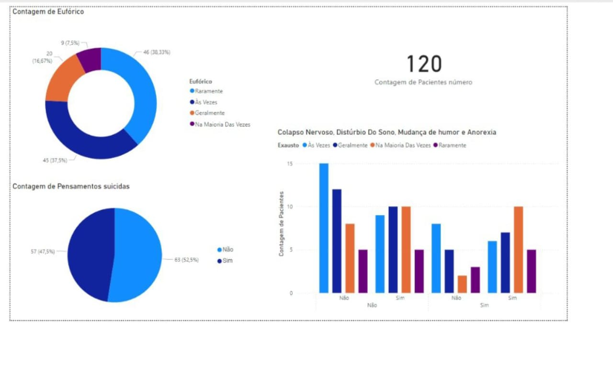

# Projeto de Análise de Dados de Saúde Mental - Power BI

## Descrição do Arquivo Big Data em Saúde Mental.pbix  
O arquivo `Big Data em Saúde Mental.pbix` apresenta um conjunto de dados e relatórios criados no Power BI, com foco na análise da relação entre pacientes e diversos transtornos de saúde mental. Ele oferece visualizações interativas que permitem identificar padrões, tendências e insights valiosos, contribuindo para uma melhor compreensão dos dados e suporte à tomada de decisões.

## Imagem Gerada (Tabela.py)  

