# Projeto de Análise de Dados de Saúde Mental - Python

## Descrição do Arquivo Tabela.py
O arquivo `Tabela.py` é responsável por gerar uma tabela de exemplo que ilustra a relação entre os pacientes e os diversos transtornos que podem afetá-los. Essa tabela serve como um modelo prático para análise de dados, facilitando a visualização e a compreensão das informações.

## Descrição do Arquivo Detalhes.py
O arquivo `Detalhes.py` apresenta um gráfico que representa visualmente os resultados da pesquisa realizada com os pacientes, destacando a incidência de diferentes transtornos. Esse gráfico proporciona uma visão clara das tendências e padrões encontrados nos dados, auxiliando na interpretação dos resultados.

## Imagem Gerada (Tabela.py)

Abaixo está a imagem da tabela gerada pelo código:

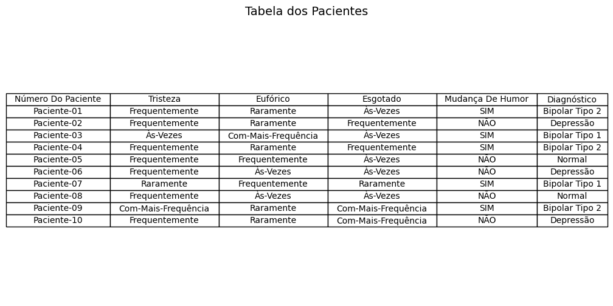

## Imagens Geradas (Detalhes.py)

Abaixo estão as imagens dos gráficos gerados pelo código:

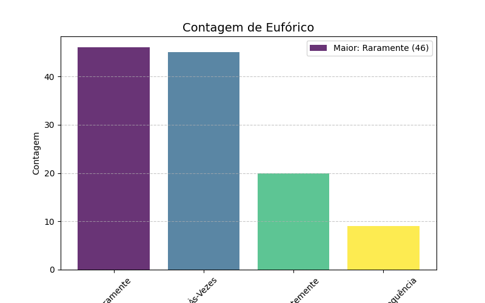
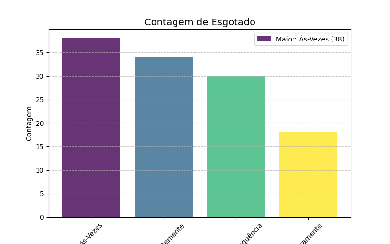

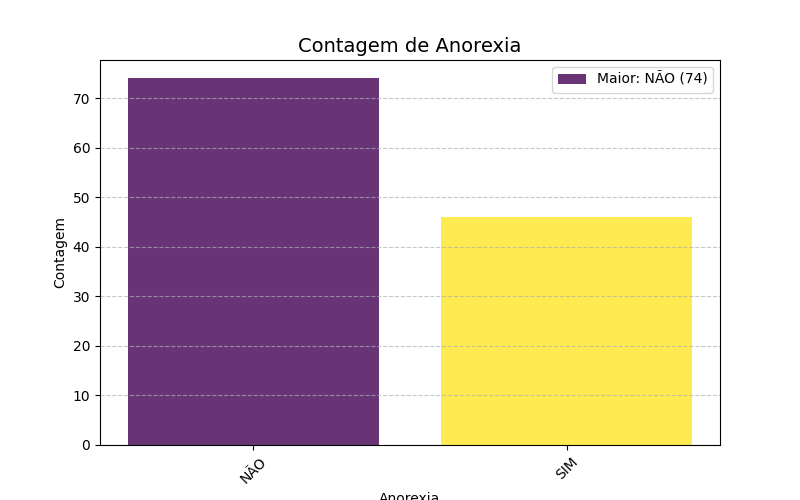

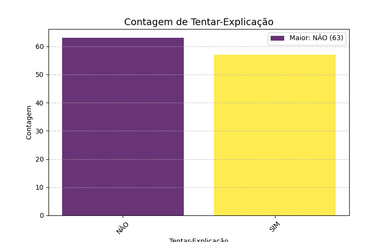

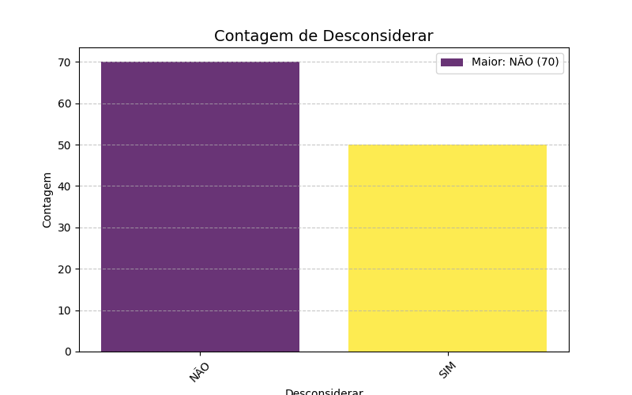

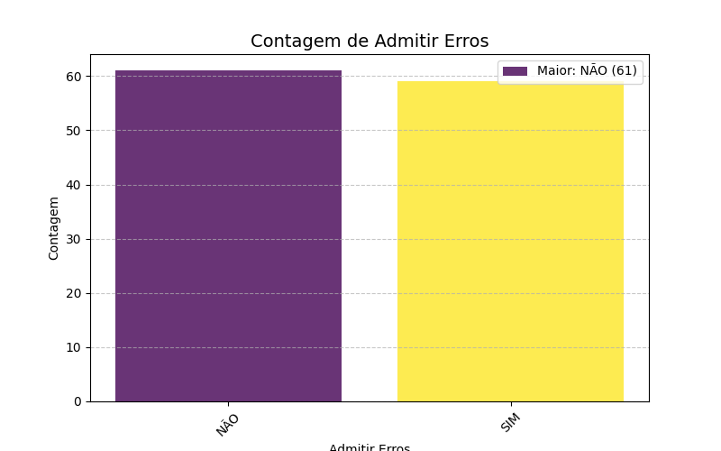
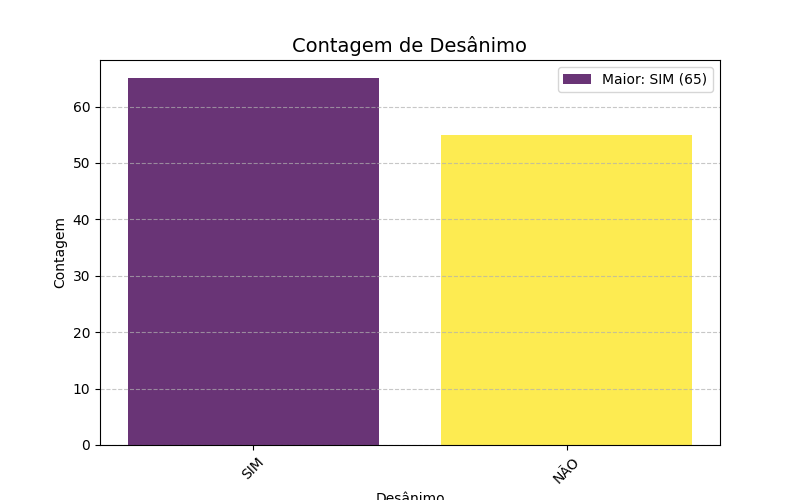

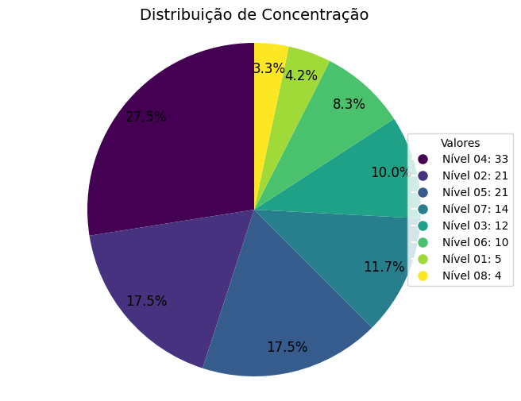
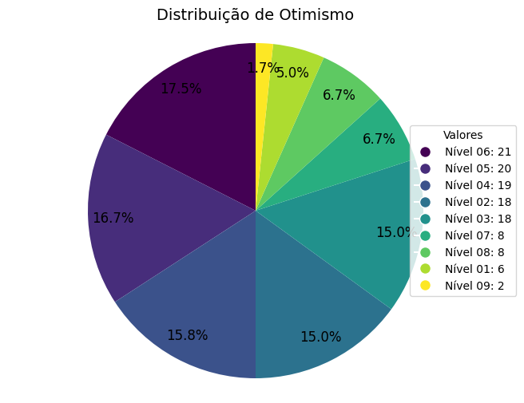
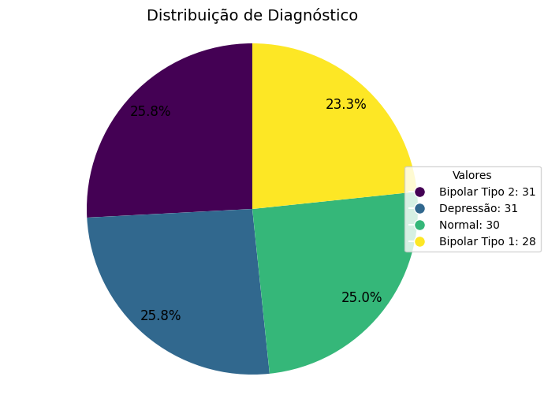
