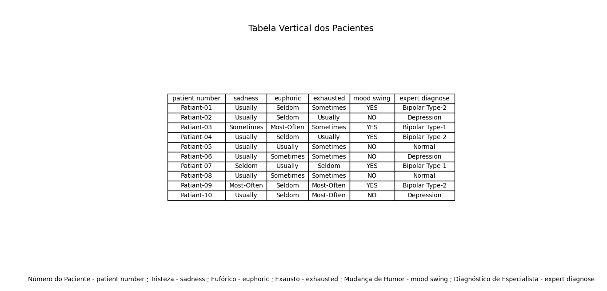

# Projeto de Análise de Dados de Saúde Mental

Este projeto apresenta um script em Python, denominado `Tabela.py`, que analisa dados sobre transtornos mentais.

## Descrição do Arquivo Tabela.py

O arquivo `Tabela.py` realiza as seguintes operações:

1. **Importação de Bibliotecas**: Utiliza `pandas` para manipulação de dados e `matplotlib` para visualização.

2. **Leitura do Arquivo CSV**: Carrega um arquivo CSV chamado `Dataset-Mental-Disorders.csv` a partir do diretório atual.

3. **Limpeza de Dados**: Remove espaços em branco dos nomes das colunas e os converte para minúsculas.

4. **Seleção de Dados**: Extrai e exibe as primeiras 10 linhas de colunas específicas relacionadas a pacientes.

5. **Criação de Tabela**: Gera uma tabela visual com as informações selecionadas e adiciona traduções dos cabeçalhos.

6. **Exibição**: Mostra a tabela em uma janela gráfica.

## Imagem Gerada

Abaixo está uma imagem da tabela gerada pelo código:

